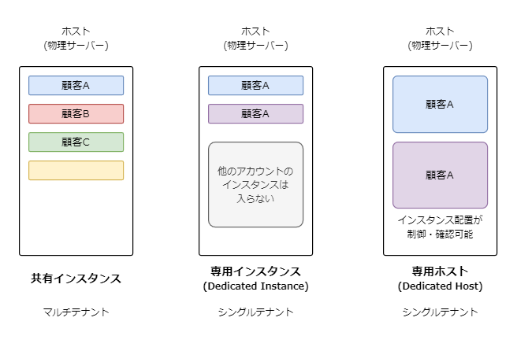

AWS の SAA の勉強中に、EC2 の共有インスタンス、専用インスタンス、専用ホストの違いがわからなかったので、調べてみました。

## AWS EC2 の共有インスタンス、専用インスタンス、専用ホストについて理解する

Amazon Web Services（AWS）は、Elastic Compute
Cloud（EC2）サービスを通じてさまざまなホスティングオプションを提供しています。
これらの中には、共有インスタンス、専用インスタンス、専用ホストが含まれます。

本記事では、これら 3 つのインスタンスの違いについて述べます。

### 共有インスタンス

共有インスタンス、別名「デフォルト」インスタンスは、最も一般的なタイプの EC2 インスタンスです。

これらは**マルチテナント**であり、あなたのインスタンスは他の AWS の顧客からのインスタンスと同じハードウェアを共有します。

これは最も費用対効果の高いオプションですが、厳格なコンプライアンスやセキュリティ要件を持つアプリケーションには適していない場合があります。

### 専用インスタンス

専用インスタンスは、単一のハードウェア上で実行される EC2 インスタンスです。

これらは**シングルテナント**であり、他の顧客とハードウェアを共有しません。

これにより、より高いレベルのセキュリティとコンプライアンスが提供されますが、**インスタンス単位で費用がかかります**。

### 専用ホスト

専用ホストは、EC2 インスタンス容量が完全にあなたの使用に専用された物理サーバーです。

これらは**シングルテナント**であり、他の顧客とハードウェアを共有しません。

また、**ホスト単位で費用がかかります**。

これらは、Windows Server、SQL Server、SUSE Linux Enterprise Server などの既存のサーバー依存のソフトウェアライセンスを使用することが可能です。

これらは最も高価なオプションですが、最高レベルの制御とセキュリティを提供します。

### 専用ホストと専用インスタンスの違い

専用インスタンスと専用ホストの両方とも、シングルテナントである。
専用インスタンスと専用ホストのインスタンスの間には、パフォーマンス、セキュリティ、物理的な違いはないです。
ソフトウェアライセンスの有無とインスタンス単位とホスト単位でコストがかかかることに違いがあります。

## まとめ

以下に、共有インスタンスと専用インスタンスと専用ホストの違いをまとめました。

|                          | 共有インスタンス       | 専用インスタンス       | 専用ホスト           |
| ------------------------ | ---------------------- | ---------------------- | -------------------- |
| 課金                     | インスタンスごとの課金 | インスタンスごとの課金 | ホストごとの課金     |
| テナント                 | マルチテナント         | シングルテナント       | シングルテナント     |
| 自前のライセンス（BYOL） | 部分的なサポート       | 部分的なサポート       | サポートされています |
