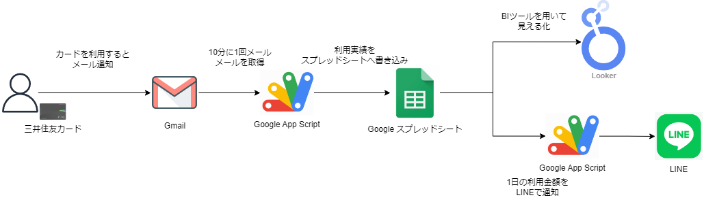

最近、三井住友カードのOliveを作りました。
メールで利用実績を確認するのですが、いちいちメールを確認するのがめんどくさいです。
アプリを開くのも面倒です。でも自分の利用実績を正しく把握したいと思い、毎日LINEで通知するようにしました。

また、お金のかからない方法で実装しました。

## 全体像



1. カードを利用
2. 利用通知がメールで届く
3. 10分に1回メールを確認
4. 利用実績をスプレッドシートに記入
5. 1日に1回LINEで利用実績額を通知
5. Lookerを用いて見える化


## 実装

### Gmail → スプレッドシートへの書き込み

このコードでは、getEmails関数がメールを取得し、writeToSheet関数がスプレッドシートに書き込みます。
getEmailsAndWriteToSheet関数を実行することで、メールの取得とスプレッドシートへの書き込みが行われます。

```GAS
// メールの取得を行う関数
function getEmails(senderEmail, targetSubject) {
  var yesterday = getYesterdayDate();
  var emailData = [];
  var searchQuery = 'from:' + senderEmail + ' subject:' + targetSubject + ' after:' + yesterday;
  var searchResult = GmailApp.search(searchQuery);
  
  for (var i = 0; i < searchResult.length; i++) {
    var messages = searchResult[i].getMessages();
    for (var j = 0; j < messages.length; j++) {
      var messageId = messages[j].getId();
      var body = messages[j].getPlainBody(); // メール本文を取得
      var res_body = extractTransactionDetails(body) 

      emailData.push([messageId, res_body[0], res_body[1], res_body[2], res_body[3]]);
    }
  }

  return emailData;
}

function getYesterdayDate() {
  var now = new Date();
  var yesterday = new Date(now.getTime() - 24 * 60 * 60 * 1000); // 昨日の日付を取得
  var yyyy = yesterday.getFullYear();
  var mm = ('0' + (yesterday.getMonth() + 1)).slice(-2);
  var dd = ('0' + yesterday.getDate()).slice(-2);
  return yyyy + '/' + mm + '/' + dd;
}

function extractTransactionDetails(text) {
  var dateRegex = /利用日：([\d/:\s]+)/;
  var storeRegex = /利用先：(.+)/;
  var transactionRegex = /利用取引：(.+)/;
  var amountRegex = /利用金額：(.+?)円/;

  var dateMatch = text.match(dateRegex);
  var storeMatch = text.match(storeRegex);
  var transactionMatch = text.match(transactionRegex);
  var amountMatch = text.match(amountRegex);

  var date = dateMatch ? dateMatch[1].trim() : "";
  var store = storeMatch ? storeMatch[1].trim() : "";
  var transaction = transactionMatch ? transactionMatch[1].trim() : "";
  var amount = amountMatch ? amountMatch[1].trim() : "";

  return [date, store, transaction, amount];
}

// スプレッドシートへの書き込みを行う関数
function writeToSheet(emailData) {
  var spreadsheetId = 'スプレッドシートID'; // スプレッドシートIDを入力
  var sheetName = 'シート名'; // シート名を入力
  var ss = SpreadsheetApp.openById(spreadsheetId);
  var sheet = ss.getSheetByName(sheetName);
  var dataRange = sheet.getRange(2, 1, sheet.getLastRow() - 1, 6); // ID列を含めるため範囲を変更
  var data = dataRange.getValues();
  var existingIds = data.map(function (row) {
    return row[0]; // ID列の値を取得
  });

  for (var i = 0; i < emailData.length; i++) {
    if (existingIds.indexOf(emailData[i][0]) === -1) { // 重複がない場合
      var newRow = [
        emailData[i][0],
        emailData[i][1],
        emailData[i][2],
        emailData[i][3],
        emailData[i][4]
      ];
      sheet.appendRow(newRow);
    }
  }
}

// メール取得とスプレッドシートへの書き込みを実行する関数
function getEmailsAndWriteToSheet() {
  var senderEmail = "statement@vpass.ne.jp"; // 送信者のメールアドレスを指定
  var targetSubject = "ご利用のお知らせ【三井住友カード】"; // 件名を指定
  var emailData = getEmails(senderEmail, targetSubject);
  // Logger.log(res);
  writeToSheet(emailData);
}

```


### スプレッドシート → LINE通知
以下のGoogle Apps Script（GAS）のコードは、スプレッドシートから利用実績を取得し、LINEに通知するものです。

このコードでは、sendNotification関数がスプレレッドシートから利用実績を取得し、LINEに通知する処理を行います。
sendNotification関数内で以下の手順が行われます。

```GAS
function sendNotification() {
  // 利用データが入力されているシートを取得
  var spreadsheetId = 'スプレッドシートID'; // スプレッドシートIDを入力
  var sheetName = 'シート名'; // シート名を入力
  var sheet = SpreadsheetApp.openById(spreadsheetId).getSheetByName(sheetName);

  // 利用データを取得
  var data = sheet.getDataRange().getValues();

  // 今日の日付を取得
  var today = new Date();

  // 合計金額を計算
  var total = 0;
  for (var i = 1; i < data.length; i++) {
    var date = new Date(data[i][1]);
    if (date.toDateString() == today.toDateString()) {
      total += parseInt(data[i][4]);
    }
  }

  // LINE Notifyに通知する
  var token = "LINE Notifyのトークン"; // ここにLINE Notifyのトークンを入力してください
  var message = "利用金額は" + total + "円です。";
  var options = {
    "method": "post",
    "payload": "message=" + message,
    "headers": { "Authorization": "Bearer " + token }
  };
  UrlFetchApp.fetch("https://notify-api.line.me/api/notify", options);
}

```

