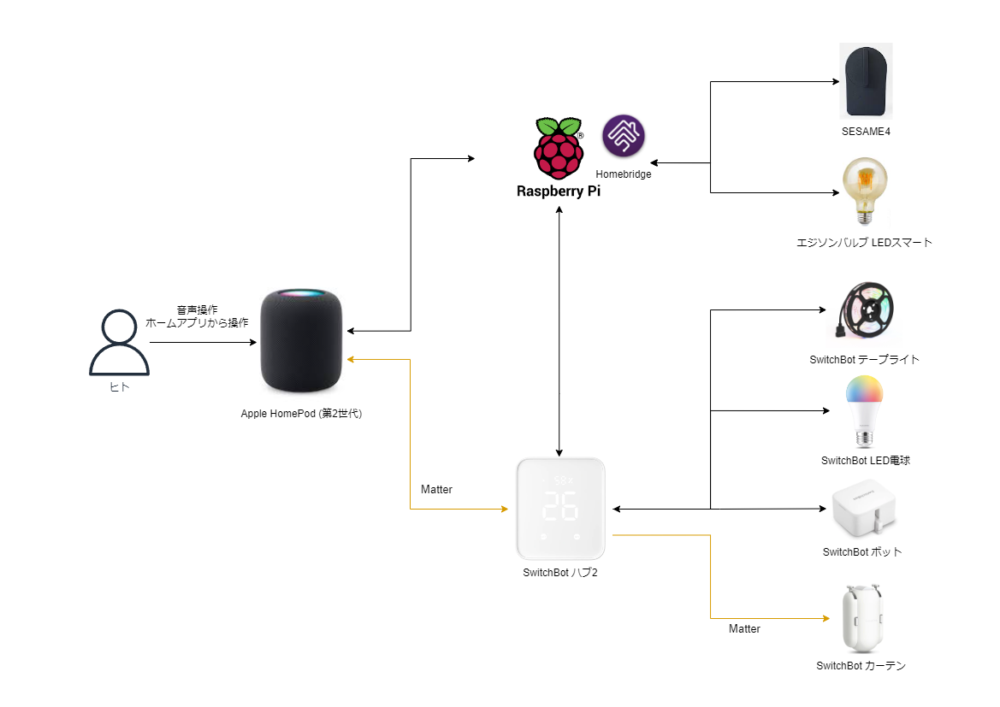
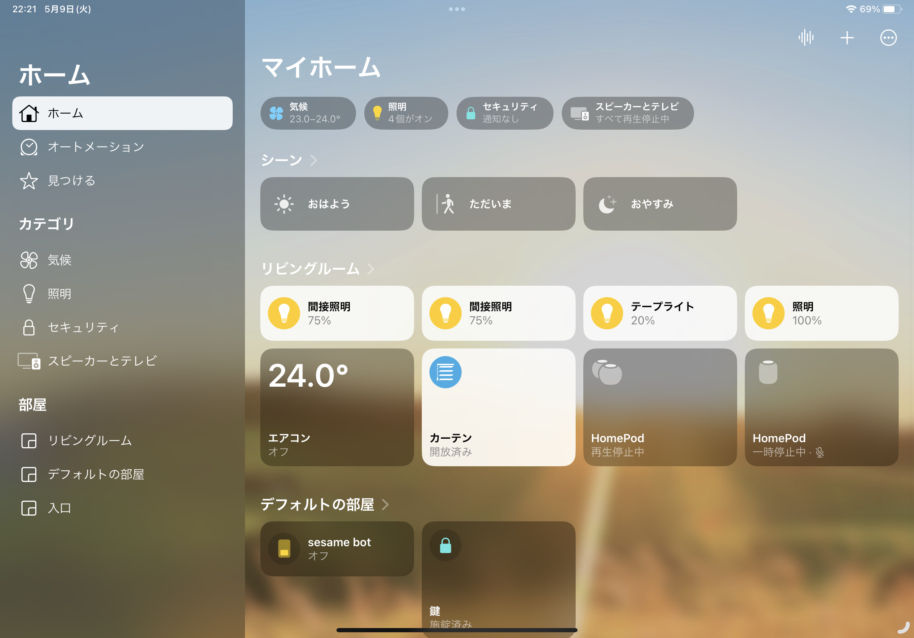

スマートホームというと、Alexa、Siri、Google Homeなど、さまざまなアシスタントと連携したIoTデバイスを利用していると思います。
しかし、デバイスやアシスタントが多種多様になってくると、統一感のある操作や管理が難しくなり、結果として使い勝手が悪くなってしまいます。
そこで、今回は私がAppleのホームアプリを中心にスマートホームを構築した経験を備忘録として記録しようと思います。

Apple製品を日常的に利用している方にとって、ホームアプリは直感的で使いやすく統一感のあるスマートホームを作るのに最適です。
私も個人的にはこのアプリが好きです。
一方、Homekit対応製品が少ないという問題があり、メインで使っている人は少ない印象です。

## スマートホームの全体像

まず、スマートホームの全体像を把握するために、使用するIoTデバイスとそれらの接続方法を解説します。

以下の図は、このスマートホームで使用するIoTデバイスの構成を示しています。

### 使用するIoTデバイス

以下のIoTデバイスを利用してスマートホームを構築しています。

- 照明
  - エジソンバルブLEDスマート

- 間接照明
  - SwitchBot テープライト
  - SwitchBot LED × 2

- 鍵
  - SESAME4
  - SwitchBot ボット

- カーテン
  - SwitchBot カーテン × 2

- ハブ
  - SwitchBot ハブ2

- スマートスピーカー
  - HomePod mini × 2
  - HomePod 第2世代

### デバイスの接続方法

SwitchBot ハブ2とSwitchBot カーテンはMatter（スマートホームデバイスの共通プロトコル）をサポートしているため、Matterを通じて接続します。

一方、Homekit非対応のデバイス（SESAME4、SwitchBotボット、tuya）については、Raspberry PiにHomeBridgeを設置して接続します。
HomeBridgeは、非対応のデバイスをHomeKitで使えるようにするソフトウェアです。

## ホームアプリの活用

このように設定することで、ホームアプリから全てのデバイスを一元的に操作することが可能になります。
特に、HomePodを利用することで、声だけで家電を操作するというスマートホームの理想を実現することができます。

ホームアプリでは、各デバイスのステータスを一覧表示でき、必要に応じて個別に操作できます。
さらに、「シーン」を設定することで、特定の状況（例えば「就寝前」や「起床時」）に合わせて複数のデバイスを一度に操作することも可能です。
私は、「おはよう」「おやすみ」「ただいま」の3つシーンを作成しています。
「いってきます」を設定していない理由は、家から離れると自動的に電気やエアコンなどが消えるように設定しているからです。

## まとめ

スマートホームは、生活をより快適で便利にするための有力な手段ですが、その構築には様々なデバイスやシステムを統合する必要があります。
この記事では、Appleのホームアプリを中心にスマートホームを構築する方法を紹介しました。
これにより、Apple製品を日常的に使用している方でも、手軽にスマートホームを始めることができます。

特に、非対応のIoTデバイスでもHomeBridgeを利用すればHomekitで使うことが可能となります。
これにより、ホームアプリから全てのデバイスを統一的に操作することができます。
