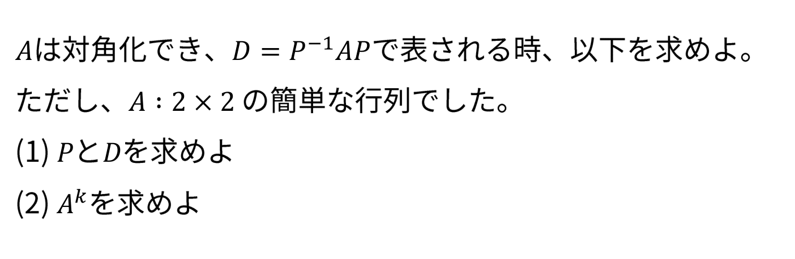
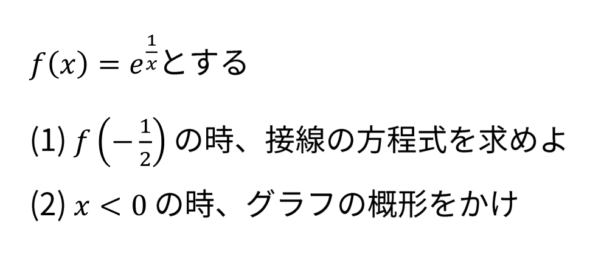

NASIT(奈良先端科学技術大学院大学)を知ったきっかけは、大学4年の4月に友達が受験を検討していたことから知りました。

その後、5月のオープンキャンパスに参加し、気になる研究室の先輩に話を聞いたり、研究室の見学をしました。

ここでは、誰かの役に立てるかもしれないと思い、NASIT情報科学領域の受験体験記を共有したいと思います。

受験したのは、2019年の第一回試験です。

## 試験対策

### 小論文

小論文では、A4用紙2枚にこれまでの研究内容と今後の研究内容を記述します。
私は非情報系出身で、取り組みたい研究内容について詳しく知らなかったため、希望研究室の教授にメールで連絡し、今後のテーマについて相談しました。
そのテーマに関して調査したり、論文を読んだりして小論文を作成しました。
完成した小論文は、希望研究室の先輩に添削を依頼し、さらに同じ大学の同期や先輩にも添削をお願いしました。

### 英語

英語は、試験がなくTOEIC or TOEFLのスコアがそのまま点数になります。
事前提出もできますが、受験日当日に持ち込むことができます。
また、学内で受けたTOEIC IPも利用できました。
ちなみに僕は500点台のスコアを提出しました・・・。(英弱です)

### 数学

数学では、線形代数と解析学の問題をホワイトボードを使いながら、面接官の前で解説する形式です。2019年の入試から出題範囲が教科書から指定されるようになりました。

- G.ストラング，線形代数イントロダクション(Chapter 1 から Chapter 7)
- S.ラング，解析入門(Part I から Part IV)

ただし、これは2019年の試験範囲なので、最新の情報は願書で確認してください。

私は物理系出身で、線形代数や解析学が得意だったため、あまり勉強しませんでした。
指定された教科書はレベルが高く、そこまで難しい問題は出ないと思ったので、マセマ（線形代数、微分積分）を中心に復習していました。
一部の演習問題は指定参考書から解いていました。
また、過去問をまとめたサイトがあり、どの程度のレベルの問題が出るかを確認していました。

- 参考文献
  - https://github.com/tubutubucorn/naist-exam
  - https://www.shirayu.net/note/naist/data/exam.pdf

### 面接

ホームページに記載されている通り、小論文の内容について3分間話す必要があるため、その準備を行いました。

また、小論文に記載された内容から想定される質問を考え、それに対する返答も準備していました。

小論文をしっかりとまとめておけば、面接の練習をあまり行わなくても対応できると思います。

## 試験当日
受付で受験票を提示し、TOEICの提出を済ませた後、受験者待機室へ向かいました。そこで面接の順番を確認し、私は1番目でした。

最初に、試験の20分前からアンケートに回答するよう案内されます。その後、数学の問題を閲覧する部屋へと案内されました。

注意すべき点として、与えられた計算用紙は口頭試問の部屋に持ち込むことができません。閲覧時間は10分間です。

次に、数学の口頭試問が行われる部屋へ案内されました。

ホワイトボードで問題を解き進め、面接官が質問したい点があると途中で止められる形式でした。詳細な説明は求められず、正直驚きました。

数学の口頭試問が終わると、すぐに面接の部屋へと案内されます。

入室後、受験番号と名前を確認され、最初に回答したアンケートの内容が正しいか確認されます。その後、3分間で小論文の内容について説明することになりました。

残りの時間は、質問に答え続ける形でした。質問内容は、NAISTで取り組む予定の研究内容について重点的に聞かれました。現在の研究内容についてはほとんど触れられず、驚きでした。

覚えている範囲での質問内容は以下の通りです（小論文以外の内容も含む）。

- 小論文を書くにあたって英語の論文は読んだか？読んだ場合、題名を教えて
- 分野が違うけれど大学院の授業についていけるか
- その研究分野に興味を持った理由は何か
- プログラミング経験はあるか
- ◯◯と書いてあるけど、これはどういう意味？
- ◯◯以外にも研究手法はあるのか？

いくつかわからないことがあったので、その際はわからないと素直に答えました。

## 数学の過去問
覚えてる範囲で数学の過去問を書いておきます。(令和1年数学過去問)

適宜、ホワイトボードに記載した内容から質問が飛んでくるような感じです。

### 線形代数

### 解析学

## その他

### ゲストハウスせんたん

私は、朝一番の集合だったため、ゲストハウスせんたんに泊まろうと思ったのですが予約するのが遅すぎて満室でした。(試験の2週間前)

そのため、ゲストハウスせんたんに泊まろうと思っている人は受験票が届き次第、予約することをおすすめします。
近くにはホテルもないため、ゲストハウスせんたんに泊まるのが一番良いと思います。

## まとめ

- 研究室訪問は絶対しよう！
  - 有益な情報は得られるし教授との相性も大事
- 英語の配点は30/200であり、そこまで大きな影響はない
- 大学院で取り組みたい研究内容を中心に小論文を仕上げよう！

質問等があれば、TwitterのDMまでお願いします。

## 追記

合格最低点は200点中133点でした。(令和元年度入試)

私の点数は137点で結構ギリギリの点数でした。

ちなみに160点以上が寮に入れる条件です。